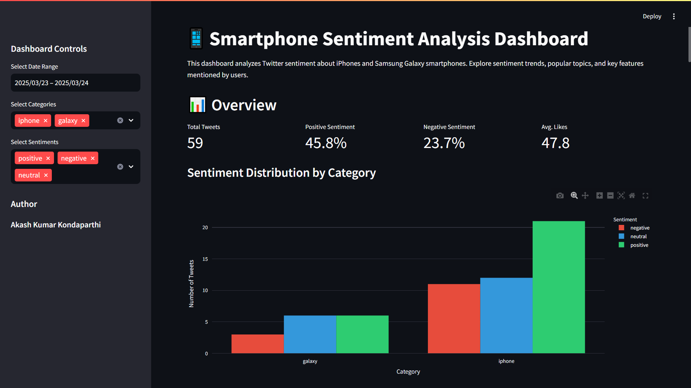

# Social Media Sentiment Analysis for Product Feedback



## Project Overview

This project analyzes Twitter sentiment about smartphones (iPhone vs. Samsung Galaxy) to identify consumer sentiment, common issues, and emerging trends. It includes data collection, preprocessing, sentiment analysis, topic modeling, and an interactive dashboard.

## Features

- **Data Collection**: Collects tweets about iPhones and Samsung Galaxy smartphones
- **Text Preprocessing**: Cleans and normalizes text data for analysis
- **Sentiment Analysis**: Analyzes sentiment using multiple approaches (VADER, TextBlob, and ML)
- **Topic Modeling**: Identifies common topics and themes in the tweets
- **Feature Extraction**: Extracts key product features mentioned in tweets
- **Interactive Dashboard**: Visualizes insights through an interactive web dashboard

## Dashboard

The interactive dashboard allows you to:
- Filter data by date range, product category, and sentiment
- View sentiment distribution and trends over time
- Explore common topics and features mentioned
- Analyze engagement metrics by sentiment
- Browse individual tweets with sentiment scores

## Live Dashboard

You can access the live dashboard at [https://your-app-url.streamlit.app](https://your-app-url.streamlit.app)

## Technologies Used

- **Python**: Core programming language
- **Tweepy**: Twitter API client for data collection
- **NLTK & spaCy**: Natural language processing
- **VADER & TextBlob**: Rule-based sentiment analysis
- **scikit-learn**: Machine learning for sentiment classification
- **Gensim**: Topic modeling with LDA
- **Pandas & NumPy**: Data manipulation
- **Matplotlib, Seaborn & Plotly**: Data visualization
- **Streamlit**: Interactive dashboard creation
- **GitHub**: Version control and code sharing

## How to Run the Project

### Prerequisites

- Python 3.9 or higher
- Twitter Developer Account for API access

### Installation

1. Clone the repository:
   ```
   git clone https://github.com/AkashKK25/social-media-sentiment-analysis.git
   cd social-media-sentiment-analysis
   ```

2. Install dependencies:
   ```
   pip install -r requirements.txt
   ```

3. Download required NLTK and spaCy data:
   ```
   python -m nltk.downloader punkt stopwords wordnet vader_lexicon
   python -m spacy download en_core_web_sm
   ```

4. Configure Twitter API credentials:
   - Open the file named `config_secret.py` in the root directory
   - Add your Twitter API credentials
   - Change the file name to `config.py`

### Execution

1. Collect data:
   ```
   python scripts/scrape_tweets.py
   ```

2. Preprocess data:
   ```
   python scripts/preprocess_data.py
   ```

3. Run sentiment analysis:
   ```
   python scripts/run_sentiment_analysis.py
   ```

4. Run topic modeling:
   ```
   python scripts/run_topic_modeling.py
   ```

5. Launch the dashboard:
   ```
   cd dashboard
   streamlit run app.py
   ```

### Execution (Alternative)

You can run the entire pipeline with:
```bash
python run_project.py
```

To run specific parts of the pipeline, use command line arguments:
```
# Skip tweet collection (use existing data)
python run_project.py --skip-tweets

# Run only the dashboard
python run_project.py --dashboard-only

# Collect more tweets (run collection 5 times)
python run_project.py --sample-size 5 --skip-nltk --skip-preprocess --skip-sentiment --skip-topics
```
**Command-line options**:

`--skip-nltk`: Skip the NLTK setup step
`--skip-tweets`: Skip tweet collection
`--tweets-only`: Only scrape tweets (tweet collection)
`--skip-preprocess`: Skip preprocessing
`--skip-sentiment`: Skip sentiment analysis
`--skip-topics`: Skip topic modeling
`--dashboard-only`: Only run the dashboard
`--sample-size N`: Run tweet collection N times to accumulate more data


## Project Structure

```
social-media-sentiment-analysis/
├── data/               # Data storage
│   ├── raw/            # Raw collected data
│   ├── processed/      # Preprocessed data
│   └── results/        # Analysis results
├── dashboard/          # Dashboard files
│   ├── app.py          # Main dashboard application
│   └── dashboard_utils.py  # Helper functions
├── models/             # Trained models
├── notebooks/          # Jupyter notebooks for EDA
├── scripts/            # Python scripts
│   ├── scrape_tweets.py       # Data collection
│   ├── preprocess_data.py     # Text preprocessing
│   ├── text_preprocessing.py  # Text processing utilities
│   ├── sentiment_analysis.py  # Sentiment analysis
│   ├── run_sentiment_analysis.py  # Run sentiment analysis
│   ├── topic_modeling.py      # Topic modeling
│   └── run_topic_modeling.py  # Run topic modeling
├── .gitignore          # Git ignore file
├── config.py           # Configuration (API keys, etc.)
├── requirements.txt    # Project dependencies
└── README.md           # Project documentation
```

## Author

[Akash Kondaparthi](https://AkashKK25.github.io/Data-Portfolio) - [akashkondaparthi@gmail.com](mailto:akashkondaparthi@gmail.com)